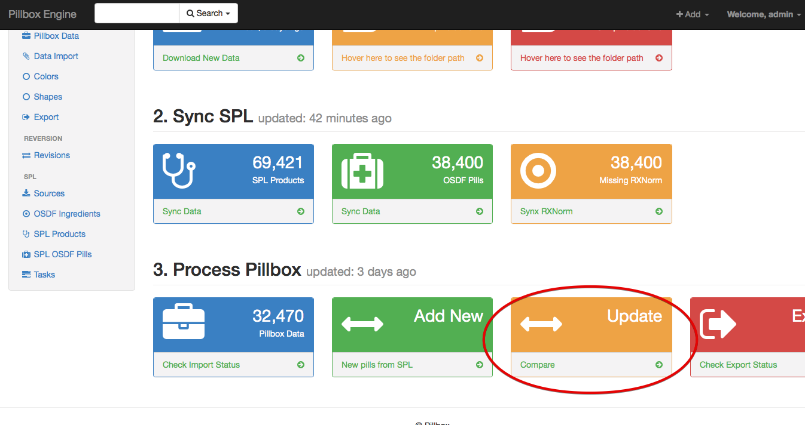

The Pillbox section of the engine is where the bulk of the process is happening.

To start, you have to import the latest version of Pillbox data.

Download the latest master data [from here](http://pillbox.nlm.nih.gov/developer.html#data). Then use the Graphic Interface to import the data to the system.

## Import Pillbox Data

After download the pillbox data, import it by going to the **Data Import** page and adding a new data import. You can check the progress of the import by clicking on the import action box on Dashboard page.

## Add Pillbox Images

You can download the latest version of Pillbox Images [from here](http://pillbox.nlm.nih.gov/developer.html#images).

You should unzip and copy the content of this image zip file to `pillbox-engine/media/pillbox/`.

After the pillbox images are copied, you should be able to view on Pillbox Data list page.

## Add New SPL Records

The Pillbox Engine can add/append new records from SPL OSDF Pills table that are new and are not added to Pillbox Data yet.

To add new SPL records, use the Add New action box on Dashboard. Click on the action box again to check the action progress.

## Update and Compare

Pillbox Engine's Update action box compare Pillbox records against SPL records and updates Pillbox data with newer information from SPL if they are available.

During this process, Pillbox Engine populates a number of comparison tables for SPL score, color, imprint, size, shape and image information. If the SPL data differs from Pillbox data on these fields, a new row is added to each compare table.

The user has to manually check each compare table and verify the errors. Is each record is verified, the corresponding row on Pillbox Data table is updated automatically.

## Export

To export Pillbox Data go to the Export page, add a new export, select a file name and the export format and save the record. Use the action box on Dashboard to check the progress of the export. When the export is finished, download the file from the action box.

